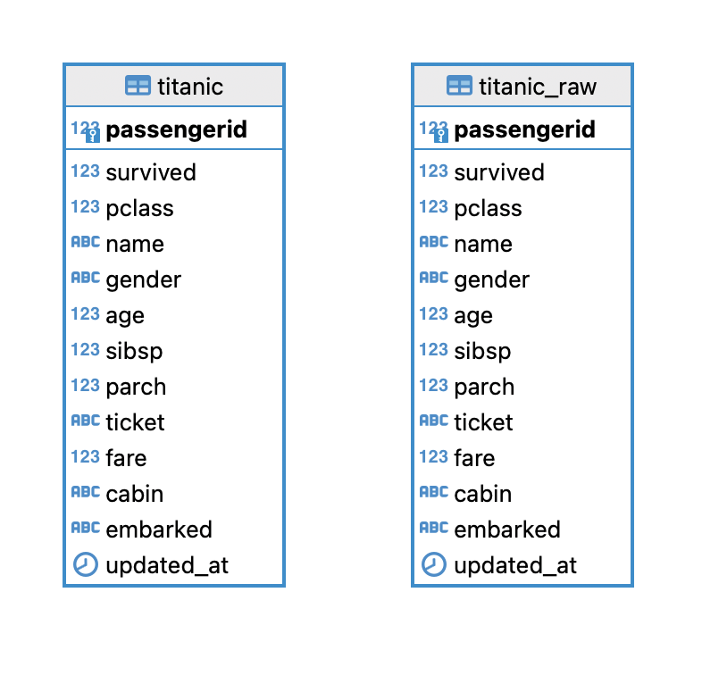
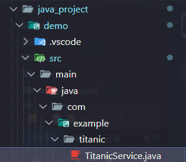
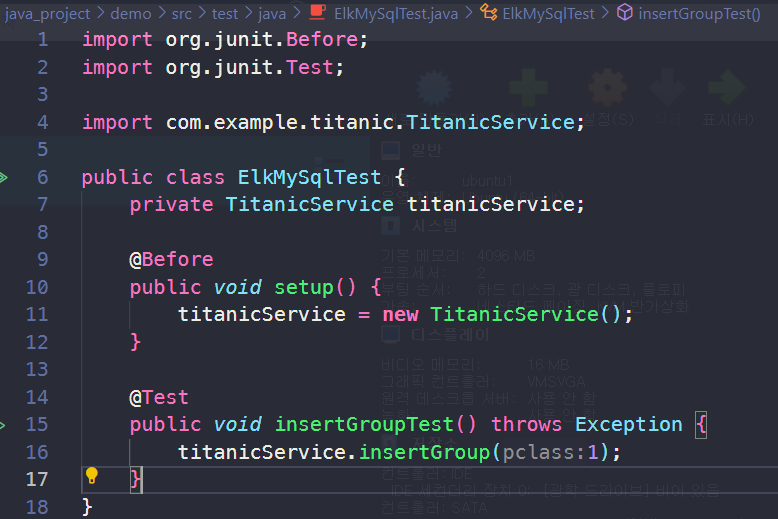
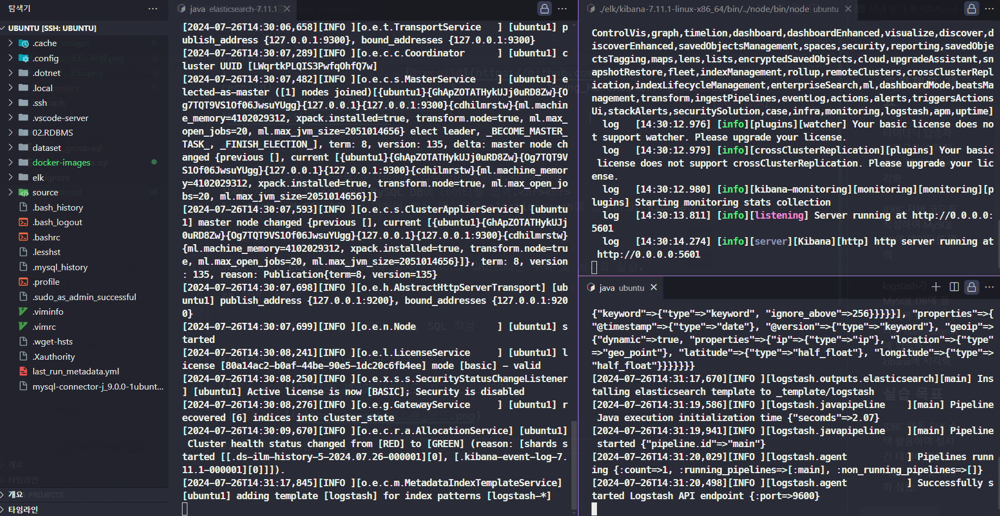
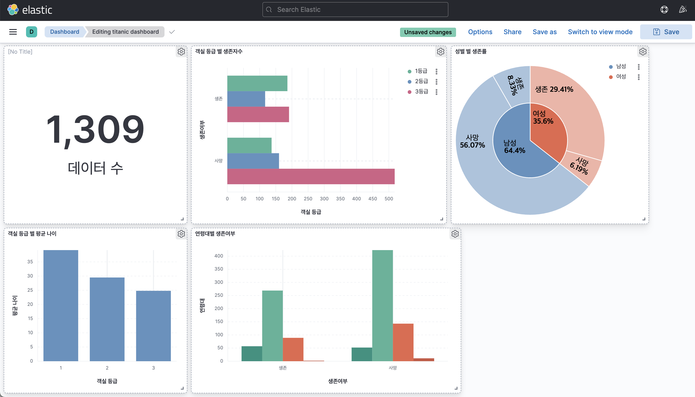
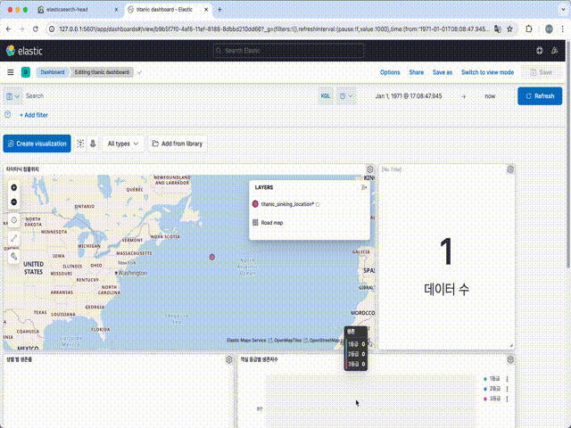

# ELK JDBC 연동 실습

## Team🏃‍♂️

|  |  |  |
| :----------------------------------------------------------------------------------------: | :----------------------------------------------------------------------------------------: | :-----------------------------------------------------------------------------------------: |
|                           [@recoild](https://github.com/recoild)                           |                       [@ChoiYoungHa](https://github.com/ChoiYoungHa)                       |                            [@0lYUMA](https://github.com/0lYUMA)                             |

## 프로젝트 개요😮

타이타닉 탑승자 그룹군을 순차적으로 입력하여 시각화
JDBC 자바 코드를 작성하여 MySQL DB에 데이터를 입력
logstash가 MySQL DB에 질의하여 얻은 데이터를 elasticsearch에 입력하고
kibana에 시각화 한다.

## 실습 목표🚘

JDBC 연동, ELK 스택 활용하여 실시간 데이터 파이프라인 구축 및 시각화 실습

## 작업 과정🛫

### 1. DBeaver에서 테이블 스키마 생성, SQL 작성👍

    

### 2. JDBC 연동하는 서비스 코드 작성🍕  

    

    

### 3. ELK 파이프라인 구축🥩

 

     
 

### 4. logstash config 작성👓

#### 🧧<a href="logstash/conf/titanic.conf">Link</a>

### 5. kibana 시각화 수행✨

    

 

## 시연 화면

    

